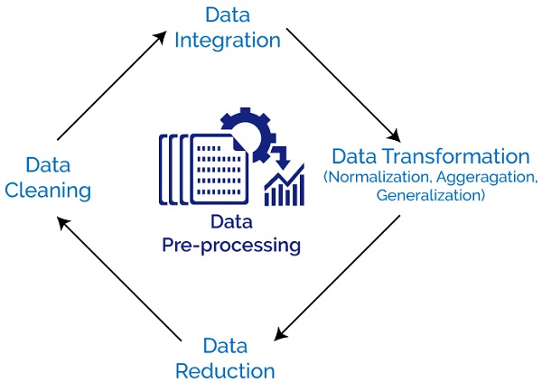

# Modul 4 - Data Preprocessing: Cleaning, Transformation, and Normalization

Di modul ini, kita bakal ngulik bareng soal **Data Preprocessing**, yaitu langkah penting sebelum data digunakan dalam analisis atau machine learning.

Kita bakal bahas:
- **Data Cleaning**: Mengatasi missing values, duplikasi, dan outlier.
- **Data Integration**: Menggabungkan data dari berbagai sumber.
- **Data Transformation**: Encoding, scaling, dan feature engineering.
- **Data Reduction**: Seleksi fitur dan reduksi dimensi.
- **Handling Imbalance Data**: Teknik oversampling, undersampling, dan SMOTE.

Data preprocessing ini penting banget karena kualitas data akan sangat memengaruhi performa model machine learning kita!

Enjoy! Hope it helps 🚀