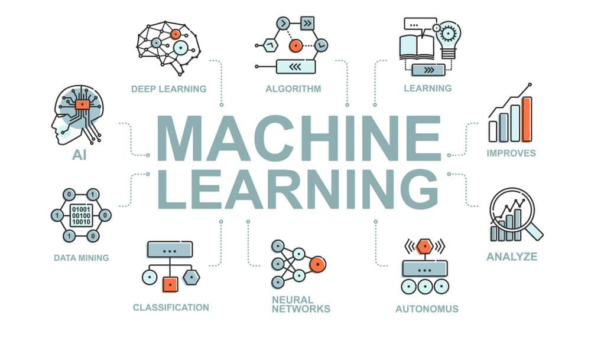

# Modul 6 - Machine Learning: Algorithms, Applications, and Model Evaluation

 

 

Di modul ini, kita bakal ngulik bareng soal **Machine Learning** dan gimana cara kerja **algoritma machine learning** dalam memecahkan berbagai masalah serta mengevaluasi model yang kita bangun. Kenapa ini penting? Karena machine learning memungkinkan kita untuk membuat prediksi yang lebih akurat dan keputusan yang lebih terinformasi berdasarkan data.

Kita bakal bahas:
- **Pentingnya Machine Learning**: Kenapa machine learning itu krusial dalam analisis data dan pengambilan keputusan.
- **Jenis-Jenis Algoritma**: Mulai dari konsep algoritma regresi, klasifikasi, clustering, hingga deep learning.
- **Mengevaluasi Model**: Langkah-langkah dalam mengevaluasi model dengan menggunakan metrik seperti accuracy, precision, recall, F1 score, dan ROC-AUC.

Jangan lupa juga buat **ikut serta di Mini Competition GWE di Kaggle**! Ini kesempatan bagus buat mengasah kemampuan machine learning dan berkompetisi dengan teman-teman.

🔗 [Link Mini Competition GWE - Kaggle](https://www.kaggle.com/t/a45fd7d2e7734f7487b3f28b03e4dcfa)

**Rules Kompetisi:**
- **Satu Peserta Satu Akun**: Peserta hanya boleh mendaftar dengan **satu akun** Kaggle.
- **Team**: Sesuaikan tim dengan **kelompok GWE** masing-masing.
- **Nama Team**: Gunakan **Nomor Kelompok GWE** sebagai nama tim.
- **Team Merger**: Ketua tim mengundang anggota lainnya untuk bergabung melalui tab **'Team'**.
- **Submission Limits**: Setiap tim dapat mengirimkan **5 submisi per hari**, reset setiap jam **07:00 WIB**.
- **Timeline**:
  - **Start Date**: 28 April 2025, 19:00 WIB
  - **End Date**: 16 Mei 2025, 23:59 WIB