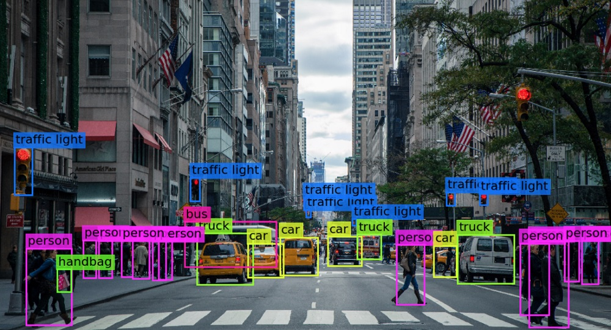

# Modul 8 - Deep Learning for Computer Vision: Techniques and Applications

 

 

Di modul ini, kita bakal eksplor gimana **Deep Learning** dimanfaatkan buat ngolah gambar dan video lewat berbagai teknik dalam dunia **Computer Vision**. Dari yang simpel kayak klasifikasi gambar sampai yang kompleks kayak deteksi objek dan pengenalan wajah! 👁️💻📸

Kenapa penting? Karena visual data itu makin banyak dipakai di dunia nyata—dari kamera pengawas, sistem rekomendasi fashion, sampai kendaraan otonom!

Kita bakal bahas:
- **Pengenalan Computer Vision**: Apa itu CV dan use-case-nya di berbagai industri.
- **Arsitektur CNN**: Gimana cara kerja Convolutional Neural Network untuk analisis gambar.
- **Transfer Learning**: Gunain model pre-trained buat tugas image classification.
- **Object Detection**: Teknik dasar deteksi objek (YOLO, SSD, dsb).
- **Aplikasi Nyata**: Contoh project CV dalam dunia nyata.

Sebelum sesi, pastiin udah:
- Install tools yang dibutuhin (Jupyter, TensorFlow/Keras, dll)
- Siapin koneksi yang stabil buat hands-on bareng

Siap-siap ngeliat dunia lewat mata AI 😎📷

Let’s unlock the vision! 🚀
