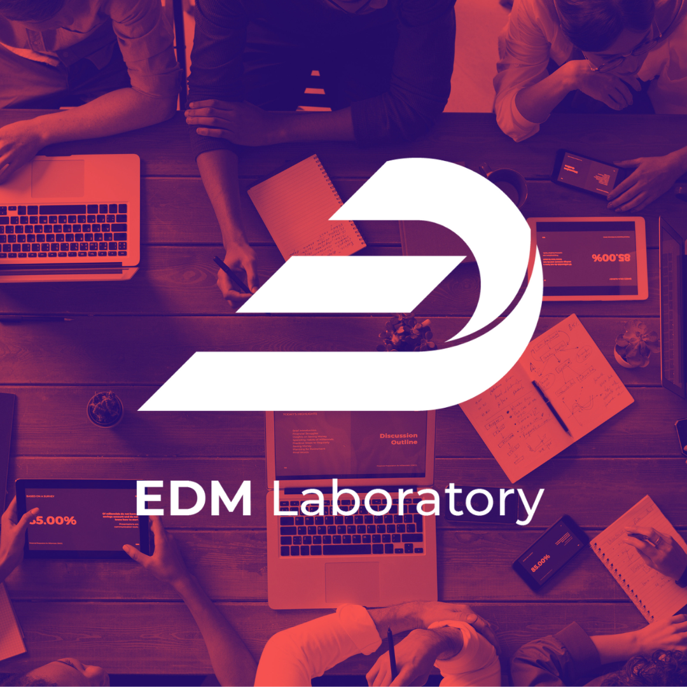

# GWE Study Group: Weekly Classes for Future Data Enthusiasts  

 

  

 

Welcome to **GWE**, a weekly class program by EDM Laboratory designed for study group members and anyone passionate about exploring the world of data. We're also striving to reach a broader audience through this repository. Enjoy the materials, and we hope they help you on your data journey! 🚀  

---

## What We Learn  
Below is a curated list of our weekly modules, along with links to the module materials and class recordings.  

| **Week** | **Module**                                                                                                   | **Class Record** |
|:--------:|-------------------------------------------------------------------------------------------------------------|:----------------:|
| **#0**   | [IT Collaboration & How To Use Notebook](https://github.com/lifeatedmlab/GWE-2025/tree/main/Modul%200%20-%20IT%20Collaboration)                              | -     |
| **#1**   | [Data Fundamentals and Web Scraping: Concepts, Tools, and Applications](https://github.com/lifeatedmlab/GWE-2025/tree/main/Modul%201%20-%20Data%20Fundamentals%20and%20Web%20Scraping)                      | [Class Record - Google Drive](https://drive.google.com/file/d/1k379vqSeP-9lup9OKIjSDKbgPhE3-wJz/view?usp=sharing) |
| **#2**   | [Data Management: Mastering Databases, Warehouses, and Data Lakes](https://github.com/lifeatedmlab/GWE-2025/tree/main/Modul%202%20-%20Data%20Management)                              |  [Class Record - Google Drive](https://drive.google.com/file/d/1ZWxttcV1zwq0Ihl51beVme9cEYFzvuCW/view?usp=sharing)    |
| **#3**   | [Business Understanding & Data Understanding: Uncovering Insights with EDA](https://github.com/lifeatedmlab/GWE-2025/tree/main/Modul%203%20-%20Business%20%26%20Data%20Understanding%20(EDA))                                 | [Class Record - Google Drive](https://drive.google.com/file/d/1SdvZkH_EHew-_TWgcTicyZcc2EpFvPib/view?usp=sharing)     |
| **#4**   | [Data Preprocessing: Cleaning, Transformation, and Normalization](https://github.com/lifeatedmlab/GWE-2025/tree/main/Modul%204%20-%20Data%20Preprocessing)                                     | [Class Record - Google Drive](https://drive.google.com/file/d/1hHgbNaj0y3-d24A9bx73N1tPKTJUsJm_/view?usp=sharing)      |
| **#5**   | [Data Visualization: Creating Impactful Insights with Tableau](https://github.com/lifeatedmlab/GWE-2025/tree/main/Modul%205%20-%20Data%20Visualization%20with%20Tableau)                                       | [Class Record - Google Drive](https://drive.google.com/file/d/1p0PhJyq2_tJnjBckRocD-lnc4JZB1ymU/view?usp=sharing)      |
| **#6**   | [Machine Learning: Algorithms, Applications, and Model Evaluation](https://github.com/lifeatedmlab/GWE-2025/tree/main/Modul%206%20-%20Machine%20Learning)                                    | [Class Record - Google Drive](https://drive.google.com/file/d/1UHKxbTG111mt4rXFMfA4tTlNNbhQoMKm/view?usp=sharing)      |
| **#7**   | [Deep Learning for Text Mining: Sentiment Analysis and NLP Applications](https://github.com/lifeatedmlab/GWE-2025/tree/main/Modul%207%20-%20Natural%20Language%20Processing)                                       |[Class Record - Google Drive](https://drive.google.com/file/d/1ScVPhNv_gvvFK1GHVZIwvE-8ywR8NJia/view?usp=sharing)  |
| **#8**   | [Deep Learning for Computer Vision: Techniques and Applications](https://github.com/lifeatedmlab/GWE-2025/tree/main/Modul%208%20-%20Computer%20Vision)                               | [Class Record - Google Drive](https://drive.google.com/file/d/1OlRGUKcelTMy_1SzCykM3wQv0aqUIKjC/view?usp=sharing)      |
| **#9**   | [Deployment: Bringing Data Solutions to Production]                                                  | Coming Soon      |  

> Stay tuned as more modules are being developed and updated!  

---

## **Meet the Mentors** 👨‍🏫  

Our mentors are here to guide and support you throughout your data journey. Get to know them below!  

| **Kode Mentor** | **Username GitHub**    |
|:--------------:|:----------------------:|
| ZIZI          | [ahmfzui](https://github.com/ahmfzui) |
| ALVR          | [alvaroocls](https://github.com/alvaroocls) |
| JHON          | [AriAnanta](https://github.com/AriAnanta) |
| VLSN          | [vilsonnn](https://github.com/vilsonnn) |
| MALE          | [MatthewSitorus](https://github.com/MatthewSitorus) |
| NDOW          | [CuPid168](https://github.com/CuPid168) |
| MAAZ          | [aliimron26](https://github.com/aliimron26) |
| EVIE          | [dyahanggunnhp](https://github.com/dyahanggunnhp) |
| KING          | [itsqal](https://github.com/itsqal) |

>💡 *Want to connect? Check out their GitHub profiles for more insights into their work!*  

---

## About the GWE Initiative  

The **GWE Study Group** is not just a series of classes—it’s a community for learners who are eager to dive deep into the data domain. With modules ranging from foundational data concepts to cutting-edge machine learning and deployment strategies, GWE aims to bridge the gap between theoretical knowledge and practical skills.  

Feel free to explore, learn, and grow. Let’s make data knowledge accessible for everyone!  
